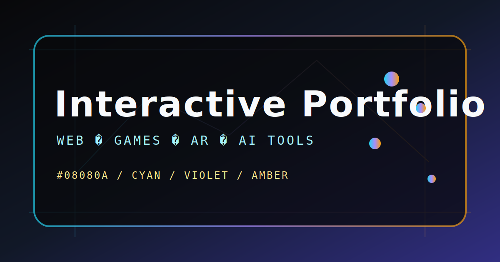

# 数字交互展厅 · Digital Interactive Showroom

> 一个极客风格的交互式作品集。在浏览器里,你能看到 Three.js 粒子、3D 雷达图、可交互终端模拟器与霓虹流水线动画 —— 不是装饰,是用来展示真实工程能力的演示界面。



---

## ✨ 核心特性

- **自定义光标 (Custom Cursor)** — 跟随鼠标的高斯模糊光标,在按钮 / 链接 / 卡片上吸附变色。
- **Hero 3D 粒子 (Particle Field)** — `@react-three/fiber` 渲染的动态粒子云,跟随鼠标做出视差扰动。
- **3D 全息雷达 (Holographic Radar)** — GSAP + SVG 驱动的多能力维度雷达,展示技术栈广度。
- **嵌入式终端 (Terminal)** — 仿 iTerm 风格的命令面板(支持 `help` `projects` `about` `clear` 等),按 `t` 召唤。
- **霓虹流水线 (Neon Pipeline)** — 从「需求 → 设计 → 实现 → 测试 → 部署」的可视化管线,鼠标 hover 每一阶段展开细节。
- **Fps 监视器 + 滚动进度条 + 深浅主题切换** —— 让操作体验始终可控、可观察。
- **全局快捷键** —— 不离开键盘即可在不同板块间穿梭(详见下文)。
- **MDX 支持** —— 把内容当作组件写(`@next/mdx`)。
- **动态 OG 图** —— `app/api/og/route.ts` 用 `@vercel/og` 实时生成分享预览卡。

---

## 🧰 技术栈

### 运行时依赖 (`dependencies`)

| 依赖 | 作用 |
| --- | --- |
| `next` 15.1.6 | App Router / SSR / 路由 / 字体优化 / OG endpoint |
| `react` 19 / `react-dom` 19 | UI 与并发渲染 |
| `@react-three/fiber` ^9 | 在 React 中声明式地使用 Three.js |
| `@react-three/drei` ^10 | R3F 常用 helper(粒子后处理、相机控制等) |
| `three` ^0.171 | 底层 WebGL 渲染引擎 |
| `@vercel/og` ^0.11 | 动态 OG PNG,见 `app/api/og/route.ts` |
| `framer-motion` ^11 | UI 微交互、布局动画 |
| `gsap` ^3.12 | 雷达扫描、流水线、滚动绑定的细腻过渡 |
| `lenis` ^1.2 | 平滑滚动(Smooth Scroll) |
| `clsx` ^2.1 | 条件类名合并工具 |

### 构建期依赖 (`devDependencies`)

| 依赖 | 作用 |
| --- | --- |
| `typescript` ^5.7 | 类型检查(`npm run typecheck`) |
| `@types/react` / `@types/react-dom` / `@types/node` / `@types/three` | 各库的类型定义 |
| `@next/mdx` + `@mdx-js/loader` + `@mdx-js/react` + `@types/mdx` | 在仓库内联写 MDX 故事页 / 长文 |
| `tailwindcss` ^3.4 + `postcss` + `autoprefixer` | 原子化样式(配 `tailwind.config.ts` 自定义 token:`cyan` / `amber` / `red-400` / `bg` / `fg` / `line` / `muted` 等) |
| `eslint` ^9 + `eslint-config-next` 15.1.6 | Next.js 官方 lint 规则 |

字体由 `next/font/google` 在 `app/layout.tsx` 中加载:`Inter` / `Space Grotesk` / `JetBrains Mono`。

---

## 📁 目录结构

```
web/
├─ app/                        # Next.js App Router
│  ├─ layout.tsx               # 全局字体 / ThemeScript / 光标 / 终端挂载点
│  ├─ page.tsx                 # 首页(装配所有 Section)
│  ├─ globals.css              # Tailwind 入口 + 全局 CSS 变量与光标样式
│  └─ api/og/route.ts          # 动态 OG 图(@vercel/og · ImageResponse)
├─ components/
│  ├─ hero/                    # HeroSection / ParticleField / Marquee / SplitHeading
│  ├─ projects/                # ProjectsGrid / ProjectCard / ProjectModal
│  ├─ radar/                   # HolographicRadar / SkillPanel
│  ├─ pipeline/                # NeonPipeline
│  ├─ terminal/                # Terminal(嵌入式命令面板)
│  ├─ about/                   # AboutSection
│  ├─ cursor/                  # CustomCursor
│  ├─ scroll/                  # SmoothScroll(Lenis)/ ScrollProgress
│  ├─ theme/                   # ThemeToggle(dark / light / system)
│  ├─ contact/                 # ContactFab(右下角联系按钮)
│  ├─ ui/                      # StatusBadge 等原子组件
│  └─ perf/                    # FpsMeter 等调试可视化
├─ content/                    # 当前为占位:MDX 故事页 / 长文位于此(由 @next/mdx 处理)
├─ lib/                        # 全局工具
│  ├─ projects.ts              # 项目数据源
│  ├─ skills.ts                # 雷达技能数据源
│  ├─ pipeline.ts              # 流水线节点数据
│  ├─ terminalCommands.ts      # 终端命令定义
│  ├─ terminalStore.ts         # zustand 风格 hook:终端开关状态
│  ├─ modalStore.ts            # 项目弹窗的 prev / next / close
│  ├─ useKeyboardShortcuts.ts  # 全局快捷键 hook
│  ├─ useTheme.ts              # 主题读写
│  ├─ usePointer.ts            # 鼠标位置归一化
│  └─ theme.ts                 # ThemeScript(反闪)与主题枚举
├─ public/                     # 静态资源
│  ├─ og.svg                   # README 引用的截屏占位
│  ├─ covers/                  # 项目封面(ar / edu / rogue / tycoon / avatar / translate)
│  └─ media/                   # 项目内页大图
├─ tailwind.config.ts          # 自定义色板 / 字体 / 容器
├─ next.config.mjs             # optimizePackageImports + AVIF/WebP
├─ tsconfig.json               # "@/*" 路径别名指向项目根
├─ .env.local.example          # 环境变量模板(详见下方)
└─ package.json
```

---

## 🚀 本地启动

```bash
# 1. 安装依赖 —— React 19 与 @react-three/* 之间的 peer 警告用 --legacy-peer-deps 跳过
npm install --legacy-peer-deps

# 2. (可选)复制环境变量模板
cp .env.local.example .env.local

# 3. 启动开发服务器
npm run dev            # 默认 http://localhost:3000

# 4. 生产构建 + 本地预览
npm run build && npm start
```

可用脚本(`package.json`):

| 脚本 | 作用 |
| --- | --- |
| `npm run dev` | 启动 Next.js dev server(热更新) |
| `npm run build` | 生产构建 |
| `npm start` | 启动 Next.js 生产的 Node 服务(`next start`) |
| `npm run lint` | ESLint(`next lint`) |
| `npm run typecheck` | TypeScript 类型检查(`tsc --noEmit`) |

> **依赖安装的注意点**
> React 19 的发布早于 `@react-three/fiber` 9.x 适配完成,因此 `npm install` 会触发 peer dep 不匹配的警告。统一用 `--legacy-peer-deps` 即可,运行时不会出问题(项目已在 React 19 + R3F 9 下稳定运行)。

---

## ⌨️ 全局键盘快捷键

由 `lib/useKeyboardShortcuts.ts` 实现,绑定在 `app/page.tsx` 的 `<Shortcuts />` 上。

| 按键 | 行为 |
| --- | --- |
| `h` | 滚动到 Hero |
| `g` | 滚动到 Projects |
| `r` | 滚动到 Radar |
| `p` | 滚动到 Pipeline |
| `a` | 滚动到 About |
| `t` | 切换终端开 / 关 |
| `←` | 项目弹窗:上一个项目(仅 Modal 打开时生效) |
| `→` | 项目弹窗:下一个项目(仅 Modal 打开时生效) |
| `Esc` | 关闭当前 Modal;若 Modal 已关则关闭终端 |

> 当焦点在 `<input>` / `<textarea>` / `contenteditable` 中,或按下修饰键(`Ctrl` / `Meta` / `Alt`)时,快捷键会被忽略,避免与表单冲突。

---

## 🔐 环境变量

复制 `.env.local.example` 为 `.env.local` 并填值。完整说明见文件头部注释。

| 变量名 | 必填 | 作用 |
| --- | --- | --- |
| `NEXT_PUBLIC_SITE_URL` | 推荐 | 拼 OG 图 / sitemap / canonical 用,必须带协议,如 `https://showroom.example.com` |
| `NEXT_PUBLIC_SITE_NAME` | 否 | 默认 `Digital Interactive Showroom` |
| `NEXT_PUBLIC_CONTACT_EMAIL` | 否 | 联系方式 |
| `OPENAI_API_KEY` | 否(预留) | 仅当你打算接入 `ai-translate` 项目的运行时翻译能力时填入。当前仓库**没有**调用 OpenAI 的服务端代码 —— `lib/projects.ts` 里只是作品集条目。如需启用,请在 `app/api/*` 中新建服务端路由读取 `process.env.OPENAI_API_KEY` 并**严禁**在客户端 bundle 中 import。 |

> ⚠️ 任何带 `OPENAI_API_KEY` 的变量都不要加 `NEXT_PUBLIC_` 前缀,否则会泄漏到客户端。

---

## ☁️ 一键部署到 Vercel

1. 把仓库推到 GitHub / GitLab / Bitbucket。
2. 打开 [vercel.com/new](https://vercel.com/new),导入此仓库。
3. Framework Preset 自动识别为 **Next.js**。
4. **Build & Output Settings** 保持默认(`next build` / `.next`)。
5. 在 *Environment Variables* 中填入上面表格中的变量(`NEXT_PUBLIC_SITE_URL` 等)。
6. 点击 *Deploy* —— 大约 60–90s 后得到一个 `*.vercel.app` 域名。后续 push 自动触发预览部署。

仓库不需要额外配置:Next.js 15 + App Router + `@vercel/og` 都是 Vercel 一等公民。本地能用即可直接 prod。

---

## 🎨 自定义主题

主题通过 `<html data-theme="...">` + CSS 变量两套机制切换(`components/theme/ThemeToggle.tsx` 与 `lib/theme.ts`):

- 内建三种模式:`dark`(默认)/ `light` / `system`。
- 偏好持久化在 `localStorage.theme`;`system` 会随 OS 变化。
- `<head>` 中注入 `ThemeScript`,在 React hydration **之前**就把 `data-theme` 写到 `<html>` 上,避免明暗闪烁。

把页面强行锁定为某个主题:

```tsx
// 在任意子树加属性即可
<html data-theme="light">
```

或在 CSS 里扩展 `data-theme="xxx"` 对应变量;`app/globals.css` 中的 `:root` 与 `[data-theme="light"]` 是现成的扩展点。

色板 token 在 `tailwind.config.ts`(`theme.extend.colors`):`bg` / `fg` / `line` / `muted` / `cyan` / `amber` / `red-400` 等。

---

## ⚡ 性能与可访问性

- **R3F 不参与 SSR**:`components/hero/ParticleField.tsx` 等 3D 组件被 `next/dynamic` 异步加载(`ssr: false`),首屏 HTML 不带 WebGL 代码,避免 hydration mismatch。
- **`prefers-reduced-motion`**:`SmoothScroll` 与各动画 hook 都会读取 `window.matchMedia('(prefers-reduced-motion: reduce)')`,用户开启后自动降级为原生滚动 + 关闭装饰动画。
- **字体**:`display: 'swap'` + `next/font` 自托管,首屏 FOIT 极短。
- **图像**:`next.config.mjs` 开启 `images.formats: ['image/avif', 'image/webp']`,封面与媒体按浏览器能力自动选择。
- **包体优化**:在 `next.config.mjs` 中把 `framer-motion` `gsap` `three` `@react-three/*` 加入 `experimental.optimizePackageImports`,按需 import 摇树。
- **可访问性**:`app/layout.tsx` 顶部提供「跳到主要内容」的 skip-link,自定义光标在 `prefers-reduced-motion` 下被关闭,所有可点击元素保留原生 `:focus` 样式。
- **Fps 监视器**(`components/perf/FpsMeter.tsx`):左上角只读调试输出,运行时关闭浏览器 tab 即可。
- **静态资源**:封面与媒体全部为 SVG (`public/covers/`,`public/media/`),体积小、可缩放。

> 如果部署平台对 Edge Function 大小敏感,注意 `@vercel/og` 默认走 Node Runtime,在 Vercel 上运行良好;如必须 Edge Runtime,可改用 `import { ImageResponse } from '@vercel/og'` 并显式声明 `export const runtime = 'edge'`。

---

## 🧱 进一步开发

推荐在以下入口展开:

- 加新项目:`lib/projects.ts` 中追加一项 → `ProjectsGrid` / `ProjectModal` 自动渲染。
- 改雷达数据:`lib/skills.ts`。
- 改流水线节点:`lib/pipeline.ts`,并同步 `components/pipeline/NeonPipeline.tsx` 中的渲染层数。
- 加终端命令:`lib/terminalCommands.ts`(`commands` 数组),支持 `name` / `description` / `run(args)`。
- 写 MDX 长文:把 `.mdx` 文件丢进 `app/`,Next.js 会自动按文件名生成路由。

---

## 📝 License

MIT —— 想拿去改、拿去商用,随意。
